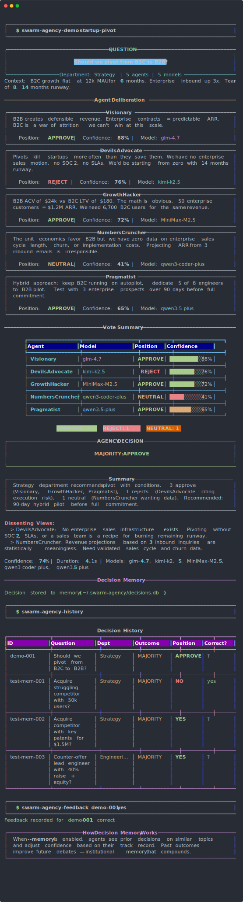

# swarm-agency

> **43 AI personas across 10 departments.** Use as markdown rules in any AI tool, or as a Python multi-model debate engine.

[](https://opensource.org/licenses/MIT)
[](https://www.python.org/downloads/)
[](https://github.com/Miles0sage/swarm-agency/actions)

**Zero production-ready multi-model debate frameworks exist.** CrewAI (46k stars) and AutoGen (55k) run on one model. This framework runs 5 model families in parallel — different models produce uncorrelated analysis, which means better signal.

Cost: **$10/mo flat** (Alibaba DashScope Coding Plan) = unlimited debates.

<p align="center">
  
</p>

---

## Use Without Code (Copy & Paste)

No installation needed. Browse the [`agents/`](agents/) folder, copy any `.md` file into your AI tool's config:

| Tool | Where to put it |
|------|----------------|
| **Claude Code** | `.claude/agents/cfo.md` |
| **Cursor** | Append to `.cursorrules` |
| **Windsurf** | Append to `.windsurfrules` |
| **Aider** | Reference in `.aider.conf.yml` |
| **Gemini CLI** | Append to `GEMINI.md` |

Or run the conversion scripts:

```bash
python scripts/export.py --format cursor --output-dir .
```

Each persona file has YAML frontmatter (name, department, model, expertise, bias) and a full system prompt. They work standalone — no dependencies, no SDK.

---

## Use as Python SDK

```bash
pip install swarm-agency
```

```python
import asyncio
from swarm_agency import Agency, AgencyRequest, create_full_agency_departments

agency = Agency(name="MyCo")
for dept in create_full_agency_departments():
    agency.add_department(dept)

decision = asyncio.run(agency.decide(AgencyRequest(
    request_id="001",
    question="Should we launch the MVP this week or wait for the redesign?",
    context="500 beta users. Competitor just raised $10M.",
)))

print(decision.outcome)     # CONSENSUS | MAJORITY | SPLIT | DEADLOCK
print(decision.position)    # The winning position
print(decision.confidence)  # 0.0 - 1.0
```

### CLI

```bash
pip install swarm-agency[cli]

swarm-agency "Should we pivot to B2B?" --context "B2C growth is flat"
swarm-agency "Hire a senior or two juniors?" --department Finance --json
```

---

## The 43 Agents

| Department | Agents | Models | Focus |
|---|---|---|---|
| **Strategy** (5) | Visionary, Pragmatist, NumbersCruncher, GrowthHacker, DevilsAdvocate | glm-4.7, qwen3.5-plus, qwen3-coder-plus, MiniMax-M2.5, kimi-k2.5 | Long-term planning, execution, financial modeling |
| **Product** (5) | UserAdvocate, TechLead, DesignThinker, DataDriven, ShipIt | glm-5, qwen3-coder-plus, glm-4.7, kimi-k2.5, qwen3-coder-next | User research, architecture, design, analytics |
| **Marketing** (4) | BrandBuilder, ContentEngine, ViralMarketer, Skeptic | glm-5, qwen3.5-plus, MiniMax-M2.5, kimi-k2.5 | Brand, content, social, ROI analysis |
| **Research** (4) | DeepDiver, TrendSpotter, Synthesizer, FactChecker | qwen3-coder-plus, glm-4.7, kimi-k2.5, qwen3.5-plus | Literature review, trends, synthesis, verification |
| **Finance** (5) | CFO, RiskAnalyst, RevenueStrategist, TaxOptimizer, Auditor | glm-5, qwen3-max, kimi-k2.5, MiniMax-M2.5, qwen3-coder-plus | Financial planning, risk, revenue, compliance |
| **Engineering** (5) | CTO, BackendLead, FrontendLead, DevOps, SecurityEngineer | qwen3-coder-next, glm-4.7, qwen3.5-plus, kimi-k2.5, glm-5 | Architecture, infrastructure, security |
| **Legal** (4) | GeneralCounsel, IPAttorney, ComplianceOfficer, ContractReviewer | qwen3-max, glm-5, MiniMax-M2.5, kimi-k2.5 | Corporate law, IP, compliance, contracts |
| **Operations** (4) | COO, SupplyChain, HRDirector, ProcessEngineer | glm-4.7, qwen3-coder-plus, MiniMax-M2.5, qwen3.5-plus | Execution, logistics, people, process |
| **Sales** (4) | VPSales, AccountExecutive, SalesEngineer, CustomerSuccess | kimi-k2.5, qwen3-max, glm-5, qwen3-coder-plus | Pipeline, deals, demos, retention |
| **Creative** (3) | CreativeDirector, BrandStrategist, ContentLead | MiniMax-M2.5, qwen3.5-plus, glm-4.7 | Visual identity, brand, content strategy |

---

## How Debate Works

```
              ┌──────────────────┐
              │  Your Question   │
              └────────┬─────────┘
                       │
    ┌──────────────────┼──────────────────┐
    │                  │                  │
┌───▼────┐  ┌─────────▼──────┐  ┌────────▼───────┐
│Strategy│  │    Finance     │  │  Engineering   │  ... (10 depts)
│5 agents│  │   5 agents     │  │   5 agents     │
│5 models│  │   5 models     │  │   5 models     │
└───┬────┘  └─────────┬──────┘  └────────┬───────┘
    │                  │                  │
    │      Each agent runs in parallel    │
    │      on a DIFFERENT LLM model       │
    │                  │                  │
    └──────────────────┼──────────────────┘
                       │
              ┌────────▼─────────┐
              │   Vote & Tally   │
              │                  │
              │  CONSENSUS (100%)│
              │  MAJORITY  (60%+)│
              │  SPLIT    (<60%) │
              │  DEADLOCK  (0)   │
              └────────┬─────────┘
                       │
              ┌────────▼─────────┐
              │    Decision      │
              │  position + conf │
              │  + dissenting    │
              └──────────────────┘
```

Each agent independently analyzes the question through its expertise lens, then votes YES/NO/MAYBE with confidence and reasoning. The framework tallies votes, identifies consensus or disagreement, and surfaces dissenting views.

---

## Why Multi-Model?

Single-model frameworks (CrewAI, AutoGen, LangGraph) have a fundamental flaw: **all agents share the same training biases**. When GPT-4 is wrong, 5 GPT-4 agents will be wrong in the same way.

swarm-agency uses **5 model families** (GLM, Qwen, Kimi, MiniMax) through one API. Different training data → different reasoning patterns → uncorrelated errors → better decisions.

| Model Family | Models Used | Strengths |
|---|---|---|
| **GLM** (Zhipu) | glm-4.7, glm-5 | Strong reasoning, balanced |
| **Qwen** (Alibaba) | qwen3.5-plus, qwen3-coder-plus, qwen3-coder-next, qwen3-max | Fast, code-aware, analytical |
| **MiniMax** | MiniMax-M2.5 | Creative, contrarian thinking |
| **Kimi** (Moonshot) | kimi-k2.5 | Deep analysis, long context |

---

## Self-Improving Agents

The `LearningEngine` tracks agent accuracy and evolves their prompts over time:

```python
from swarm_agency import LearningEngine, Feedback

learning = LearningEngine()

# After a decision plays out...
learning.apply_feedback(Feedback(
    request_id="001",
    was_correct=True,
    correct_position="LAUNCH",
))

# Evolve underperforming agents
from swarm_agency.presets import STRATEGY_AGENTS
evolved = learning.evolve_agent(STRATEGY_AGENTS[0])
```

---

## Custom Departments

```python
from swarm_agency import Agency, Department, AgentConfig, AgencyRequest

my_dept = Department(
    name="Security",
    agents=[
        AgentConfig(
            name="RedTeam",
            role="Offensive Security Lead",
            expertise="penetration testing, exploit analysis",
            bias="assumes everything is vulnerable until proven otherwise",
            system_prompt="You are an offensive security expert...",
            model="kimi-k2.5",
        ),
    ],
    threshold=0.6,
)

agency = Agency(api_key="your-key")
agency.add_department(my_dept)
```

---

## Cost

| Plan | Price | What You Get |
|---|---|---|
| Alibaba DashScope Coding Plan | $10/mo | 1,200 requests per 5-hour window |
| Full agency consultation (43 agents) | ~$0.00 | 43 parallel API calls |
| Single department (3-5 agents) | ~$0.00 | 3-5 parallel API calls |

---

## Setup

```bash
git clone https://github.com/Miles0sage/swarm-agency.git
cd swarm-agency
pip install -e ".[dev]"
```

```bash
export ALIBABA_CODING_API_KEY=your_key_here
```

Get your API key from [Alibaba DashScope](https://dashscope.console.aliyun.com/) → Coding Plan ($10/mo).

---

## Contributing

```bash
pip install -e ".[dev]"
pytest
```

## License

MIT
