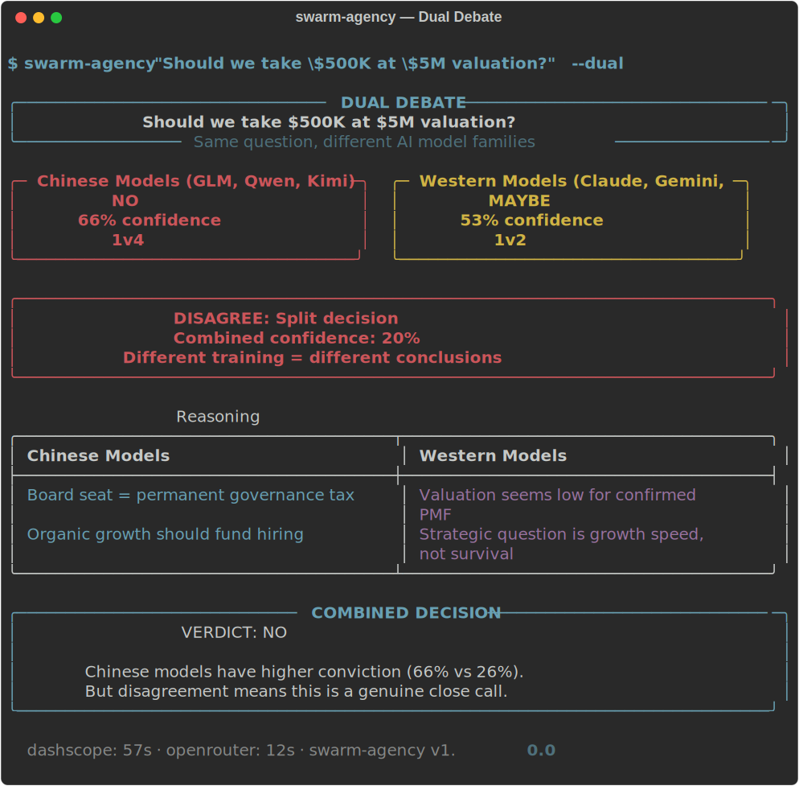
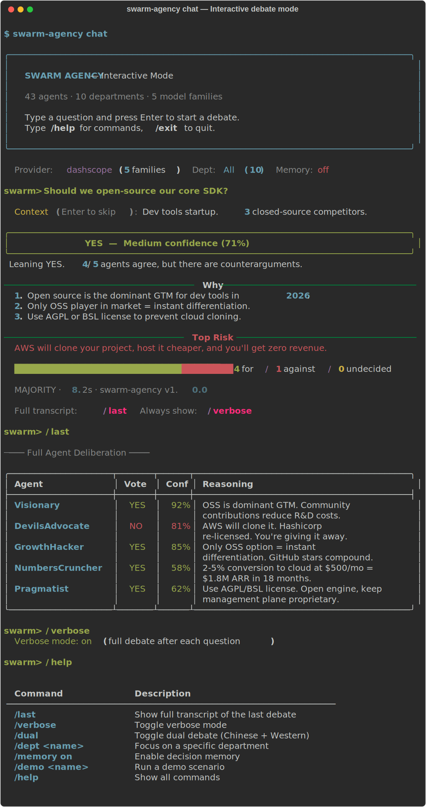

# swarm-agency

> **Pressure-test any decision from multiple AI perspectives in under a minute.**

[](https://github.com/Miles0sage/swarm-agency/actions)
[](https://www.python.org/downloads/)
[](https://opensource.org/licenses/MIT)

You ask a hard question. 5 AI agents with different expertise and biases argue about it using **different LLM model families**. You get a clear **YES/NO answer**, the top reasons, and the #1 risk.

```
$ swarm-agency "Should I take $500K at $5M valuation?"

╭──────────────────────────────────────────╮
│     NO  —  Medium confidence (67%)       │
╰──────────────────────────────────────────╯

Leaning NO. 4/5 agents agree, but there are counterarguments.

WHY:
  1. Board seat creates permanent governance tax for a small check.
  2. With PMF confirmed, organic growth should fund hiring.
  3. Selling control at worst negotiating position.

TOP RISK:
  6 months runway is tight — operational survival may outweigh
  governance concerns.

  ████████████████████████████  1 for / 4 against
```

<p align="center">
  <a href="https://asciinema.org/a/8s8vIaoxvCdF8d11"></a>
</p>

*Click to watch the full demo — install, ask, verdict, full transcript.*

**Why this is different:** ChatGPT gives you one opinion. This gives you a structured debate between agents running on **different LLM families** (GLM, Qwen, Kimi, Claude, Gemini, DeepSeek, Llama, Mistral). Different training data = different blind spots = better decisions.

---

## Try it now (no API key needed)

```bash
pip install swarm-agency
swarm-agency --demo startup-pivot
```

5 built-in scenarios: `startup-pivot`, `hire-senior`, `pricing-change`, `open-source`, `remote-vs-office`.

---

## Quick start (with API key)

```bash
# Option 1: Alibaba DashScope ($10/mo flat, 5 Chinese model families)
export ALIBABA_CODING_API_KEY=your_key

# Option 2: OpenRouter (pay-per-use, 7 Western model families)
export OPENROUTER_API_KEY=your_key

# Ask anything
swarm-agency "Should we open-source our core product?"

# Target a specific department
swarm-agency "Hire one senior or two juniors?" -d Engineering

# Dual debate: same question through Chinese AND Western models
swarm-agency "Should we raise a Series A?" --dual

# Full agent deliberation view
swarm-agency "Cut marketing budget by 40%?" --verbose

# JSON output
swarm-agency "Enter the EU market?" --json
```

---

## Dual Debate

Run the same question through **two different AI ecosystems** simultaneously. When Chinese models (DashScope) and Western models (OpenRouter) agree, confidence is high. When they disagree, you need to think harder.

```bash
swarm-agency "Should we acquire CompetitorX for $2M?" --dual
```

Shows side-by-side comparison with combined verdict:

<p align="center">
  
</p>

---

## Interactive Chat Mode

```bash
swarm-agency chat
```

Ask questions, see verdicts, dig into transcripts — all in one session:

<p align="center">
  
</p>

Key commands: `/last` (full transcript), `/verbose` (always show debate), `/dual` (Chinese + Western models), `/dept Finance` (focus department), `/memory on` (remember past decisions).

---

## API Server

```bash
swarm-agency serve

# GET /api/decide?question=Should+we+pivot
# GET /api/decide/stream?question=...  (SSE streaming)
# GET /api/dual-debate?question=...
# GET /api/agents
```

Open `http://localhost:8000` for the built-in web UI.

---

## Python SDK

```python
import asyncio
from swarm_agency import Agency, AgencyRequest, create_full_agency_departments
from swarm_agency import decision_to_verdict

agency = Agency(name="MyCo", memory_enabled=True)
for dept in create_full_agency_departments():
    agency.add_department(dept)

decision = asyncio.run(agency.decide(AgencyRequest(
    request_id="q-001",
    question="Should we acquire CompetitorX for $2M?",
    context="50k users, declining. Our product overlaps 60%.",
)))

verdict = decision_to_verdict(decision)
print(verdict.answer)       # YES / NO / MAYBE
print(verdict.confidence)   # 0.0-1.0
print(verdict.top_reasons)  # ["reason 1", "reason 2", "reason 3"]
print(verdict.top_risk)     # "what could go wrong"
```

---

## Features

| Feature | What it does |
|---------|-------------|
| **Clean verdict** | YES/NO + reasons + risk (not a wall of agent text) |
| **Multi-model** | 5-7 different LLM families catch each other's blind spots |
| **Dual debate** | Chinese vs Western models, side-by-side comparison |
| **Agent memory** | Agents remember past debates and form beliefs over time |
| **Multi-round** | Agents see each other's votes, revise positions |
| **Auto-routing** | Questions automatically go to the right department |
| **Templates** | `--template hire --candidate "Jane" --role "CTO"` |
| **Tools** | Calculator, ROI, break-even, web search |
| **API server** | FastAPI + SSE streaming + web UI |
| **Sports mode** | 10 specialized sports betting analysts |

<details>
<summary>The 43 Agents</summary>

| Department | Agents | Focus |
|---|---|---|
| **Strategy** (5) | Visionary, Pragmatist, NumbersCruncher, GrowthHacker, DevilsAdvocate | Long-term planning, execution, financial modeling |
| **Product** (5) | UserAdvocate, TechLead, DesignThinker, DataDriven, ShipIt | User research, architecture, design, analytics |
| **Marketing** (4) | BrandBuilder, ContentEngine, ViralMarketer, Skeptic | Brand, content, social, ROI analysis |
| **Research** (4) | DeepDiver, TrendSpotter, Synthesizer, FactChecker | Literature, trends, synthesis, verification |
| **Finance** (5) | CFO, RiskAnalyst, RevenueStrategist, TaxOptimizer, Auditor | Financial planning, risk, revenue, compliance |
| **Engineering** (5) | CTO, BackendLead, FrontendLead, DevOps, SecurityEngineer | Architecture, infrastructure, security |
| **Legal** (4) | GeneralCounsel, IPAttorney, ComplianceOfficer, ContractReviewer | Corporate law, IP, compliance, contracts |
| **Operations** (4) | COO, SupplyChain, HRDirector, ProcessEngineer | Execution, logistics, people, process |
| **Sales** (4) | VPSales, AccountExecutive, SalesEngineer, CustomerSuccess | Pipeline, deals, demos, retention |
| **Creative** (3) | CreativeDirector, BrandStrategist, ContentLead | Visual identity, brand, content strategy |

</details>

---

## Setup

```bash
git clone https://github.com/Miles0sage/swarm-agency.git
cd swarm-agency
pip install -e ".[dev]"
pytest  # 363 tests
```

## License

MIT
